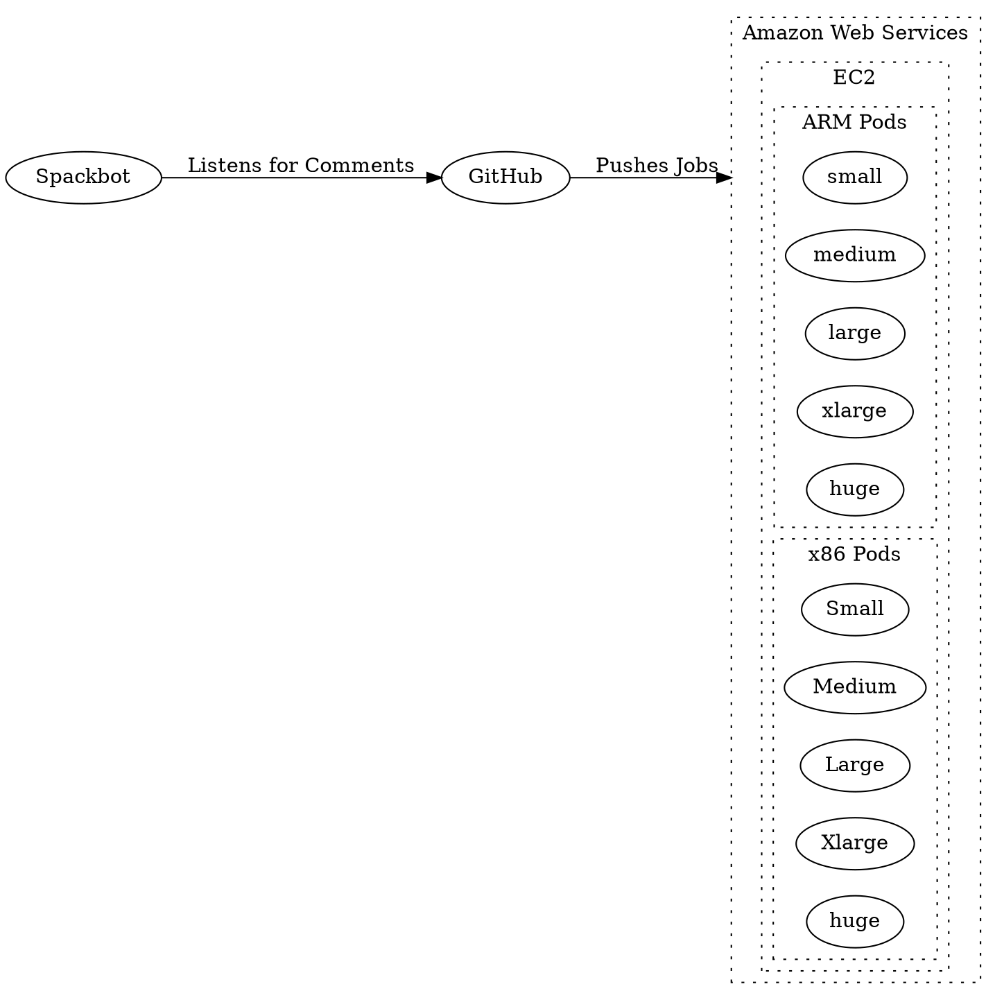
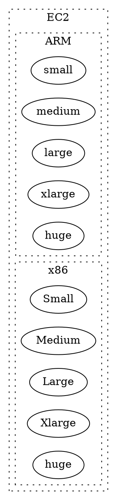

#SPACK Infrastructure

##Spackbot

Spackbot is a GitHub service account which is able to execute certain tasks.

##AWS

The AWS section of the CI infrastructure contains a Kubernetes instance which
allows for the on-demand creation of testing instances.  The instance size that
is used is determined by the tag given to the job in the GitLab CI YAML file.

##GitHub
